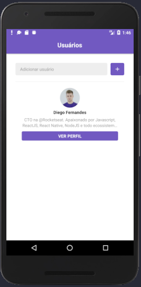
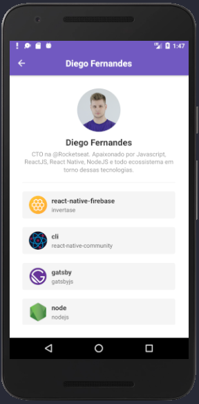
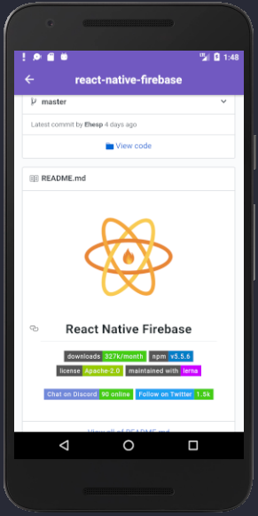

# Rocketseat Bootcamp Challenge - React Native Application

GitHub app

## Steps to Setup

1. Install dependencies

```bash
> yarn
```

2. Run App

```bash
  # android
> react-native run-android

  # ios:
> react-native run-ios
```






